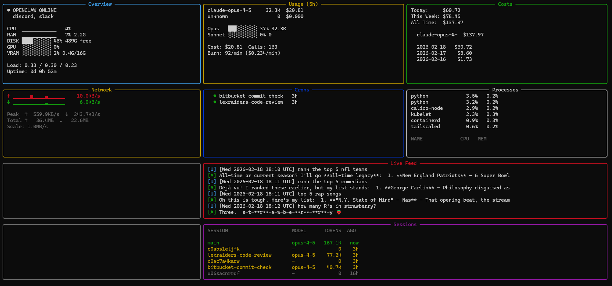

# OpenClaw TUI Dashboard

A beautiful terminal dashboard for monitoring [OpenClaw](https://openclaw.dev) AI agents in real-time.



## Features

- 🖥️ **System Health** — CPU, RAM, Disk with sparkline graphs
- 🎮 **GPU Monitoring** — NVIDIA GPU and VRAM usage (if available)
- 🤖 **OpenClaw Status** — Gateway health and connected channels
- 📊 **5-Hour Usage Window** — Token usage and rate limit tracking
- 💰 **Cost Tracking** — Spending by day, model, and all-time totals
- 📝 **Sessions** — Active sessions with model and token counts
- ⏰ **Cron Jobs** — Scheduled task status
- 📡 **Live Feed** — Real-time message stream
- 🔝 **Top Processes** — CPU/memory usage by process
- 🌐 **Network** — Upload/download with traffic sparklines

## Requirements

- Python 3.10+
- OpenClaw installed and running
- Linux, macOS, or WSL

## Quick Start

```bash
# Clone the repo
git clone https://github.com/SharkJets/openclaw-tui.git
cd openclaw-tui

# Install dependencies
pip install -r requirements.txt

# Run the dashboard
python dashboard.py
```

## Installation

### Option 1: Virtual Environment (Recommended)

```bash
git clone https://github.com/SharkJets/openclaw-tui.git
cd openclaw-tui

python -m venv .venv
source .venv/bin/activate
pip install -r requirements.txt

./run.sh
```

### Option 2: System Install

```bash
pip install textual psutil rich pynvml
python dashboard.py
```

### Option 3: One-liner

```bash
curl -fsSL https://raw.githubusercontent.com/SharkJets/openclaw-tui/main/install.sh | bash
```

## Configuration

The dashboard auto-detects OpenClaw paths. Override with environment variables:

| Variable | Default | Description |
|----------|---------|-------------|
| `OPENCLAW_DIR` | `~/.openclaw` | OpenClaw config directory |
| `WORKSPACE_DIR` | Current directory | Agent workspace |
| `OPENCLAW_AGENT` | `main` | Agent ID to monitor |

Example:
```bash
OPENCLAW_DIR=~/.openclaw OPENCLAW_AGENT=main ./run.sh
```

## Auto-Start on Boot (Linux)

To auto-start the dashboard on tty1:

```bash
# Set up auto-login on tty1
sudo mkdir -p /etc/systemd/system/getty@tty1.service.d
sudo tee /etc/systemd/system/getty@tty1.service.d/override.conf << 'EOF'
[Service]
ExecStart=
ExecStart=-/sbin/agetty --autologin YOUR_USERNAME --noclear %I $TERM
EOF

# Add to .bashrc
cat >> ~/.bashrc << 'EOF'

# Auto-start OpenClaw Dashboard on tty1
if [ "$(tty)" = "/dev/tty1" ]; then
    /path/to/openclaw-tui/run.sh
fi
EOF
```

## Keyboard Shortcuts

| Key | Action |
|-----|--------|
| `q` | Quit |
| `r` | Force refresh all panels |

## Terminal Compatibility

- **Graphical terminals** (xterm, GNOME Terminal, iTerm2, etc.): Full Unicode sparklines
- **Linux TTY**: ASCII-safe sparklines (auto-detected)

For best results on Linux TTY, install [fbterm](https://github.com/nicm/fbterm) for TrueType font support.

## Layout

```
┌─────────────┬─────────────┬─────────────┐
│   Overview  │    Usage    │    Costs    │
├─────────────┼─────────────┼─────────────┤
│  Sessions   │    Crons    │  Processes  │
├─────────────┼─────────────────────────────┤
│   Network   │         Live Feed          │
└─────────────┴─────────────────────────────┘
```

## Refresh Rates

| Panel | Interval |
|-------|----------|
| Overview, Usage, Costs, Network, Processes | 2s |
| Live Feed | 5s |
| Sessions | 10s |
| Crons | 30s |

## License

MIT License — see [LICENSE](LICENSE) for details.

## Credits

- Built for [OpenClaw](https://openclaw.dev)
- Uses [Textual](https://textual.textualize.io/) for the TUI framework
- Inspired by [openclaw-dashboard](https://github.com/tugcantopaloglu/openclaw-dashboard)

## Contributing

PRs welcome! Please open an issue first to discuss changes.
